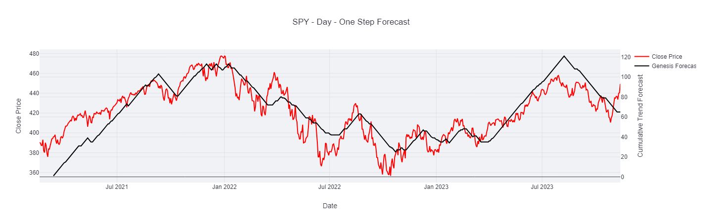
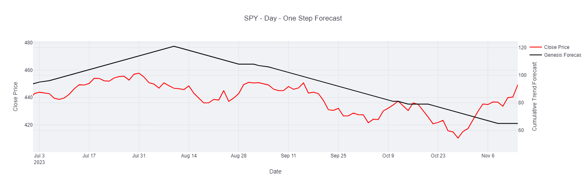
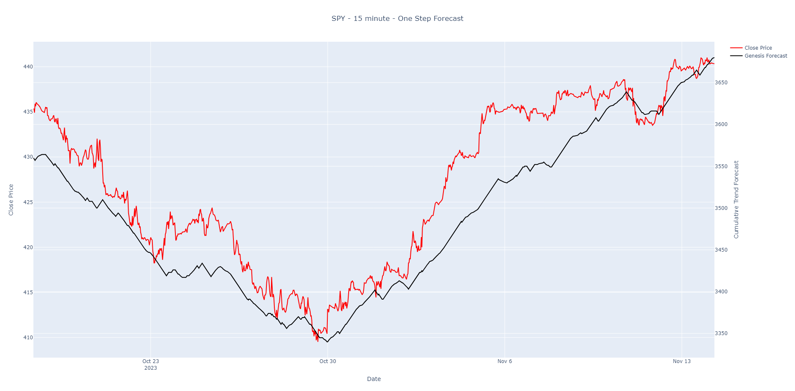
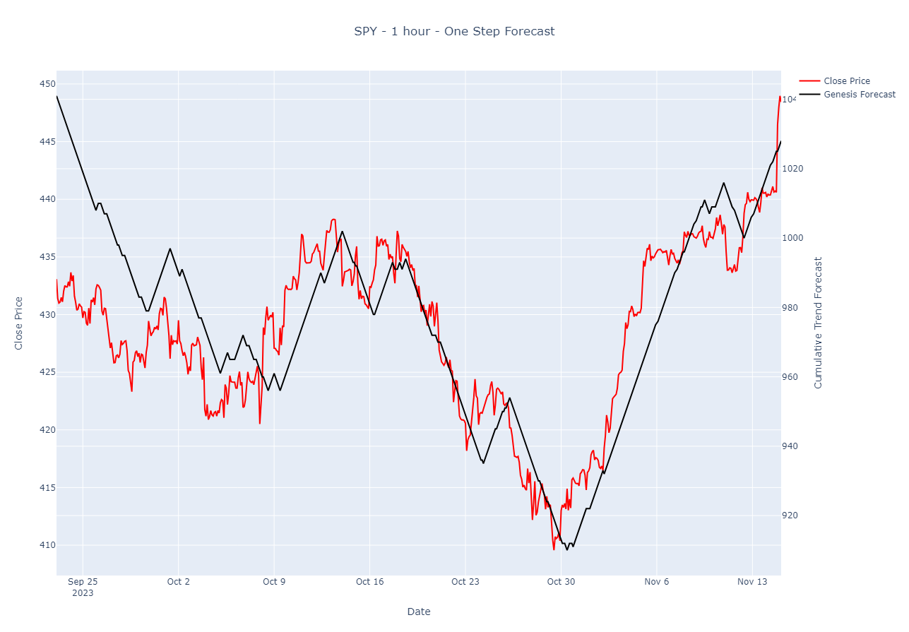
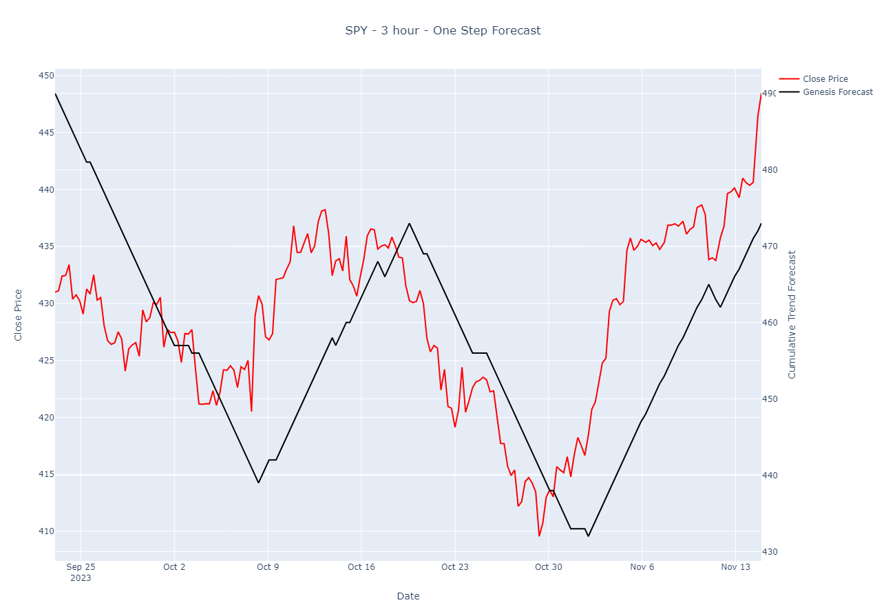

## Models
<CardGroup cols={1}>
  <Check>In Production</Check>
  <Card
    title="Genesis - https://www.sumtyme.ai/api/genesis"
    icon="lightbulb" iconType="duotone" color="#8fbc8f"
  >
  <Tabs>
  <Tab title="Description">
    A pre-trained time series model that fairly weights both short-term and long-term directional volatility.
  </Tab>
  <Tab title="Endpoint">
    https://www.sumtyme.ai/api/genesis
  </Tab>
  
  </Tabs>

    A pre-trained time series model that fairly weights both short-term and long-term directional volatility.

  </Card>
  <Card
    title="Genesis-STC: https://www.sumtyme.ai/api/genesis-stc"
    sub
    icon="lightbulb" iconType="duotone" color="#8fbc8f"
  >
    > Desc: A pre-trained time series model designed to be more sensitive to short-term price directional volatility.
  </Card>
  <Warning>In Development</Warning>
   <Card
    title="Genesis-M"
    icon="lightbulb" iconType="duotone" color="#ffa500"
  >
    > Desc: This stateful version of Genesis will remember and maintain its internal state from the previous forecast.
  
  </Card>
   <Card
    title="Genesis-STC-M"
    icon="lightbulb" iconType="duotone" color="#ffa500"
  >
    > Desc: This stateful version of Genesis-STC will remember and maintain its internal state from the previous forecast.
  </Card>
</CardGroup>

## Forecast Example
> Here we use SPY's daily time series to forecast one step ahead using Genesis.

<Tip>As Genesis ingests more data, its forecasting capabilities improve due to the additional data points enabling the model to better capture underlying patterns and context.</Tip>

<Frame caption="SPY Daily Forecast (Feb 18th 2021-Nov 14th 2023)">
  
</Frame>

<Frame caption="October 27th marked the negative inflection point.">
  
</Frame>

<Tip>Combining a shorter time horizon with our target time horizon can help inform and identify the start or end points of trends.</Tip>

> Using different time horizons, Genesis-STC predicted the end of the downtrend and the potential start of an uptrend at various times between October 30th and November 1st, 2023, ahead of the actual trend change, using the daily time series.

<Accordion title="SPY 15 Minute">

  | Datetime | Open | High | Low | Close | Trend Forecast | Risk Forecast | Risk Forecast breach |
  | --------------------- | ------ | -------- | ------ | ----- | -------------- | ------------- | -------------------- |
  | ... | ... | ... | ... | ... | ... | ... | ... |
  | 2023-10-27 23:57:00.0 | 410.42 | 413.35 | 410.22 | 413.11 | 0 | 411.27 | Y |
  | 2023-10-30 08:12:00.0 | 413.10 | 413.43 | 412.95 | 413.09 | 1 | 410.63 | N |
  | ... | ... | ... | ... | ... | ... | ... | ... |

  <Frame caption="October 27th marked the negative inflection point.">
  
  </Frame>
  
</Accordion>

<Accordion title="SPY 1 Hour">

  | Datetime | Open | High | Low | Close | Trend Forecast | Risk Forecast | Risk Forecast breach |
  | --------------------- | ------ | -------- | ------ | ----- | -------------- | ------------- | -------------------- |
  | ... | ... | ... | ... | ... | ... | ... | ... |
  | 2023-10-30 13:00:00.0 | 413.15 | 415.34 | 413.10 | 414.90 | -1 | 414.53 | Y |
  | 2023-10-30 14:00:00.0 | 414.90 | 415.03 | 412.22 | 413.03 | 1 | 412.43 | N |
  | ... | ... | ... | ... | ... | ... | ... | ... |

  <Frame caption="October 27th marked the negative inflection point.">
  
  </Frame>
  
</Accordion>

<Accordion title="SPY 2 Hour">
  | Datetime | Open | High | Low | Close | Trend Forecast | Risk Forecast | Risk Forecast breach |
  | --------------------- | ------ | -------- | ------ | ----- | -------------- | ------------- | -------------------- |
  | ... | ... | ... | ... | ... | ... | ... | ... |
  | 2023-10-31 19:00:00.0 | 418.11 | 418.50 | 417.23 | 417.4 | 0 | 418.79 | N |
  | 2023-10-31 21:00:00.0 | 417.40 | 417.68 | 417.24 | 417.52 | 1 | 412.43 | N |
  | ... | ... | ... | ... | ... | ... | ... | ... |

  <Frame caption="October 27th marked the negative inflection point.">
  
  </Frame>
  
</Accordion>

<Accordion title="SPY 3 Hour">
  | Datetime | Open | High | Low | Close | Trend Forecast | Risk Forecast | Risk Forecast breach |
  | --------------------- | ------ | -------- | ------ | ----- | -------------- | ------------- | -------------------- |
  | ... | ... | ... | ... | ... | ... | ... | ... |
  | 2023-11-01 10:00:00.0 | 416.70 | 418.79 | 416.25 | 418.42 | -1 | 418.06 | Y |
  | 2023-11-01 13:00:00.0 | 418.41 | 421.90 | 417.85 | 420.72 | 1 | 414.27 | N |
  | ... | ... | ... | ... | ... | ... | ... | ... |

  <Frame caption="October 27th marked the negative inflection point.">
  
  </Frame>
  
</Accordion>

