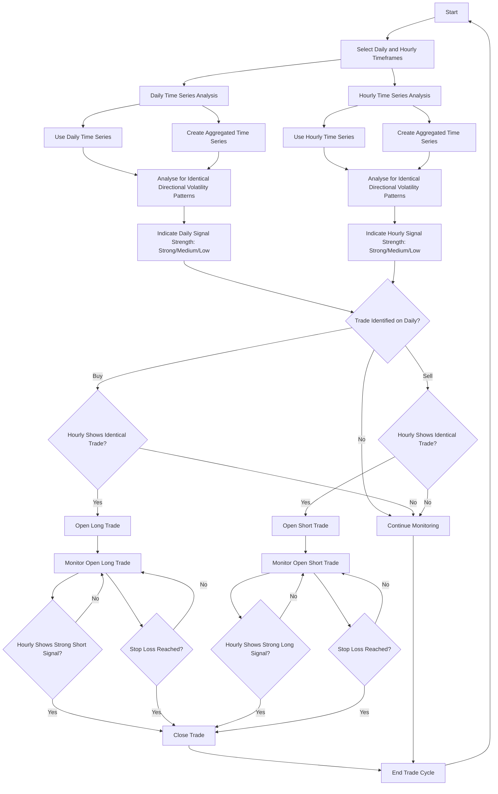

#### Trading Agent Overview

<Steps>
      <Step title="Input data">
        Client submits single time series (e.g. daily OHLC prices) via API.
      </Step>
      <Step title="Signal time series">
        Agent creates new time series by aggregating original data. Aggregation period defined by client (e.g. 3 = 3 day periods).
      </Step>
      <Step title="Analysis">
        Agent compares original time series with newly created signal series. Looks for periods where both show identical directional volatility patterns.
      </Step>
      <Step title="Trade identification">
        Agent flags matching directional volatility patterns as potential trading opportunities. 
      </Step>
      <Step title="Trade Conviction">
        Each opportunity assigned conviction level (strong, medium, or low).
      </Step>
</Steps>

#### Trading Strategy Flowchart

Multi-Timeframe Strategy:

**Entry**
Daily chart

**Exit**
Hourly chart

**Purpose**
Use larger timeframe for trend identification
Use smaller timeframe for precise exit timing

**Goal**
Optimise trade entry and exit points by leveraging different market perspectives.

